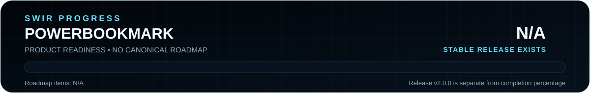

<!-- SWIR-README-STANDARD:v2 -->

<div align="center">


# PowerBookmark

**Organize trusted JavaScript snippets and authorized page tools from a compact Manifest V3 extension.**


[](https://github.com/Swir)
[](https://github.com/Swir/PowerBookmark/stargazers)

[**Highlights**](#-highlights) · [**Install**](#-quick-start) · [**Permissions**](#-permissions--safety) · [**Release**](#-progress--release-status)

</div>


## 📍 Project Status

| Item | Current state |
|---|---|
| Extension | Manifest V3, manifest version `2.0` |
| Target | Chromium-family browsers that support loading Manifest V3 unpacked extensions |
| Current interface | Polish |
| Latest public release | [`v2.0.0`](https://github.com/Swir/PowerBookmark/releases/tag/v2.0.0) |
| Product progress | **N/A** — no canonical measurable roadmap exists |

<p align="center">
  
</p>

A published version is not the same thing as a measurable project-completion percentage. Until PowerBookmark has an authoritative roadmap, SWIR Progress SVG PRO correctly reports **N/A**. See [verification notes](docs/README-VERIFICATION.md).

## 🚀 Overview

**PowerBookmark** is a local Chromium extension for storing and running user-provided JavaScript snippets. Saved scripts have a name, a domain scope and an active/inactive state, and are kept in Chrome extension local storage.

The extension also contains page-inspection and element-editing helpers. Those tools are intended for pages you own, develop or are otherwise authorized to test. PowerBookmark is not presented as a way to bypass another service's access controls or security policy.

## ✨ Highlights

| Feature | What it does |
|---|---|
| 🧩 Local script list | Stores reusable JavaScript snippets with names and domain scopes. |
| 🌐 Domain targeting | Runs active snippets on a configured host or, when explicitly selected, across sites. |
| 🎚️ Enable / disable | Toggles saved scripts without deleting them. |
| ✏️ Script editor | Adds or edits a snippet from the popup and normalizes `javascript:` bookmarklet text before saving. |
| 🎯 Page inspection tools | Provides interactive element selection/editing helpers for authorized development or testing work. |
| 💾 Local extension storage | Keeps `userScripts` in `chrome.storage.local`. |
| 🛡️ Manifest V3 | Uses the current extension manifest model with declared permissions. |
| 🌙 Compact dark UI | Ships a Polish popup interface and a project icon. |

### What is not claimed

- The visible **JSON backup** button in `popup.html` is not currently wired to an event handler in `popup.js`, so working backup/restore is **not** advertised as a feature.
- An English application variant is **not** present in this checkout.
- No Chrome Web Store publication is claimed by this README.


## ⚙️ Quick Start

### Recommended — existing release package

Download [`PowerBookmark-v2.0.0-Chromium.zip`](https://github.com/Swir/PowerBookmark/releases/tag/v2.0.0) from the public release, extract it, then load the extracted extension directory using your Chromium browser's **Load unpacked** developer-mode flow.

The release also publishes a `.sha256` sidecar for the ZIP. Keep the checksum file together with the downloaded archive if you want to verify that package locally.

### From source

```bash
git clone https://github.com/Swir/PowerBookmark.git
```

Then load the cloned directory as an unpacked extension. The folder containing [`manifest.json`](manifest.json) is the extension root.

No npm install or build step is required by the current source layout.

## 📋 Requirements / Compatibility

- A Chromium-family browser with Manifest V3 and unpacked-extension support.
- Developer mode when loading the source or extracted release as an unpacked extension.
- JavaScript must be enabled for the pages where you intentionally use the extension's page tools.

The release workflow labels its package **Chromium** and its release notes explicitly mention Chrome/Edge. This migration does not extend that claim to every Chromium-derived browser or to Firefox/Safari.

## 🔐 Permissions & Safety

The current manifest requests:

- `storage` — save extension configuration and user scripts;
- `activeTab` and `scripting` — interact with the active page;
- host permission `<all_urls>`;
- a content script matching `<all_urls>`.

PowerBookmark can execute **user-supplied JavaScript in the context of pages you visit**. That is powerful and should be treated like running code from a local developer console:

1. Only save/run scripts you understand and trust.
2. Use page-modification tools only on sites and environments you own or are authorized to test.
3. Review snippets before enabling broad `*` domain scope.
4. Do not use the extension to defeat authentication, access controls, paywalls, account restrictions or other security protections.

The repository does not include a remote script feed in the current manifest/source reviewed for this migration; saved snippets come from the user. The broad host permission still deserves careful handling.

## 🧠 Technology / Structure

| File | Role |
|---|---|
| [`manifest.json`](manifest.json) | Manifest V3 metadata, permissions, popup, icon and content-script registration |
| [`popup.html`](popup.html) | Polish popup UI |
| [`popup.js`](popup.js) | Saved-script management and popup actions |
| [`content.js`](content.js) | Page-context execution and authorized inspection/editing helpers |
| [`icon.png`](icon.png) | Extension/project icon |
| [`.github/workflows/release.yml`](.github/workflows/release.yml) | Manifest validation, ZIP/checksum packaging and GitHub Release publishing |

## 📊 Progress & Release Status

<p align="center">
  
</p>

**Product readiness: N/A.** There is no canonical `ROADMAP.md` or equivalent measured scope, so no defensible completion percentage can be reproduced. The SVG generator emits N/A and no filled segment.

The latest verified public release is **v2.0.0**, published September 12, 2026, with a Chromium ZIP and SHA-256 sidecar. The existence of that release is tracked independently from product-completion progress.

[**PowerBookmark v2.0.0 →**](https://github.com/Swir/PowerBookmark/releases/tag/v2.0.0) · [**All releases →**](https://github.com/Swir/PowerBookmark/releases)

## ⚠️ Limitations / Notes

- The current UI is Polish only.
- The JSON backup control is currently present in the popup markup but has no implemented popup handler.
- Broad host/content-script access means users should keep the installed extension and every saved snippet under their control.
- No `LICENSE` file is currently present; this migration does not infer or assign licensing terms.
- This documentation migration does not change source behavior, permissions, manifest version, package contents, release tags or workflow behavior.

## 🔎 Search Keywords

`bookmarklet manager` • `javascript snippet manager` • `chrome script manager` • `manifest v3 extension` • `local javascript snippets` • `domain scoped scripts` • `chromium developer extension` • `page inspection tool` • `chrome storage scripts` • `custom page tools` • `unpacked chrome extension` • `browser script organizer`


<div align="center">


### `STORE • SCOPE • RUN`

**PowerBookmark — by Swir**

⭐ **If this project is useful, consider leaving a star.**

[**← SWIR profile**](https://github.com/Swir) · [**All projects →**](https://github.com/Swir?tab=repositories) · [**Report an issue**](https://github.com/Swir/PowerBookmark/issues)

</div>
